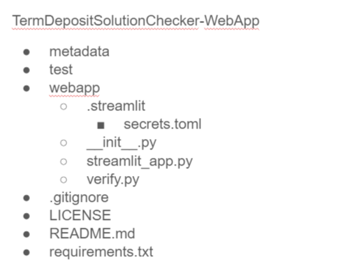

# Validate Your ML Model Performance on Term Deposit Dataset from Kaggle

### This repository contains all the files for a ML prediction-checking web app.
#### Actual solutions are shielded from the public using [Streamlit's secrets management](https://docs.streamlit.io/en/stable/deploy_streamlit_app.html#secrets-management).

**Try it now**:\
<a href="https://share.streamlit.io/yuenherny/termdepositsolutionchecker-webapp/main/webapp/streamlit_app.py">

</a>

## Credit to:
1. [**Brajesh Mohapatra**](https://github.com/brajeshmohapatra) for the dataset hosted on Kaggle.

2. [**The Streamlit team**](https://streamlit.io/) for the Streamlit framework and for making Python deployment easier.

## How to use the web app

1. Download the [Term Deposit Prediction Dataset](https://www.kaggle.com/brajeshmohapatra/term-deposit-prediction-data-set)
from Kaggle. In the dataset, there are several files:
   - `train.csv`: A CSV dataset containing the instances for training your ML model (with labels).
   - `test.csv`: A CSV dataset containing the instances for testing your ML model (without labels).
   - `solution_checker.xlsx`: A Excel file for you to check the performance of your ML model locally.
    
2. Train your model using `train.csv`.

3. Predict with your model using `test.csv`. Your output should be a `.csv` file with no column headers, and contains 
   13,564 instances.
   
4. Go to the [web app](https://share.streamlit.io/yuenherny/termdepositsolutionchecker-webapp/main/webapp/streamlit_app.py)
and upload your prediction `.csv` file at the sidebar.
   
5. Check your prediction results - accuracy, precision, recall and F1-score.

6. Share your work with the world!

## How to use this repository

1. You may choose to use Anaconda or Miniconda for environment setup. I used Miniconda for this project.

2. Clone this project repo into your local.

3. Before you can use this for your own project, you need to perform some manual steps.

   - You need to create a `test` folder to store your example solution for testing the web app.
   - You need to create a `.streamlit` folder under `webapp` folder to store your secrets (aka your answers).
   - Your answers should be in a file named `secrets.toml` so that you can use Streamlit's secret management.
   
   <p align="center">
      
   </p>
   
4. Now, your local repo should be ready for further modification.
5. To test, go into `webapp` directory and run Streamlit:
   ```
   cd webapp
   streamlit run streamlit_app.py
   ```

For detailed documentation, you may refer to my Medium 
article [here](https://yuenherny.medium.com/developing-a-ml-model-performance-validation-web-app-using-streamlit-97eb70d8d31).

Happy tweaking!

<hr style="border:1px solid"> </hr>
<p align="center">
   <b>END</b>
</p>
<hr style="border:1px solid"> </hr>